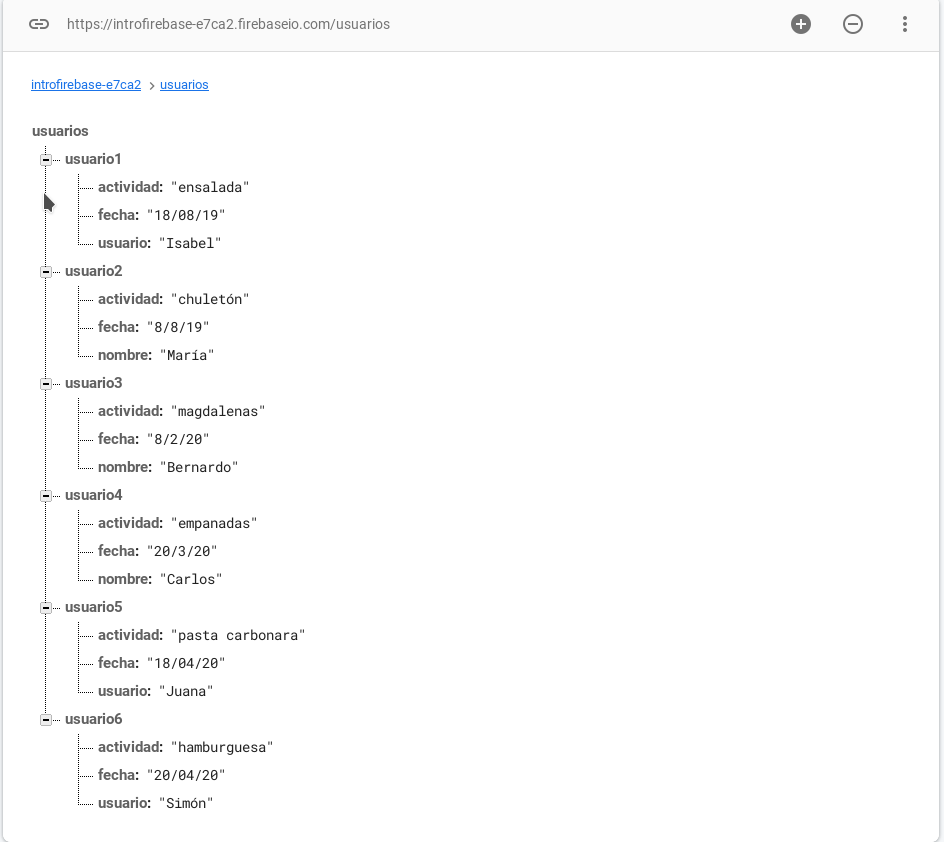
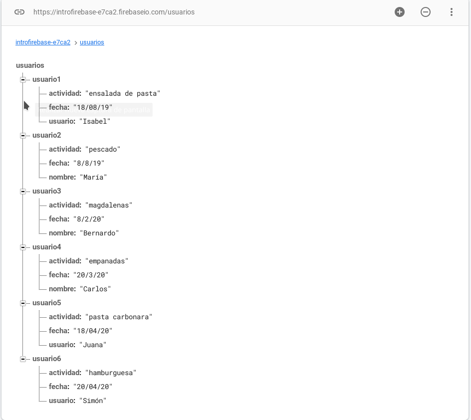

## Práctica 7: Introducción a Firebase I - Informe

### Grupo 14 del martes.

- Damián E. Domínguez De Barros
- Bárbara V. García Deus
- Laura Cañizares Herrera.

---

#### 1. Base de datos antes de las actualizaciones.


#### 2. Insertando nuevo usuario.

```javascript
buttonInsertar.onclick = () => {
  referencia = database.ref("/usuarios/usuario6");
  //Escribir un documento
  referencia.set({
    actividad: "hamburguesa",
    fecha: "20/04/20",
    usuario: "Simón",
  });
};
```



#### 3. Actualizando datos.

```javascript
buttonCambiar.onclick = () => {
  referencia = database.ref("/usuarios/usuario1");
  //Actualizar un documento
  referencia.update({
    actividad: "ensalada de pasta",
  });

  referencia = database.ref("/usuarios/usuario2");
  //Escribir un documento
  referencia.update({
    actividad: "pescado",
  });
};
```



#### 4. Obteniendo datos.

```javascript
buttonObtener.onclick = () => {
  // Consultar datos, se muestran todos los datos en la raíz
  referencia = database.ref("/");
  referencia.once("value", (snapshot) => {
    console.log(snapshot.val());
  });

  //Consultar datos, se muestra la actividad del usuario1
  referencia = database.ref("/usuarios/usuario1");
  referencia.on("value", (snapshot) => {
    console.log("Usuario 1: ", snapshot.val().actividad);
  });

  //Consultar datos, se accede a la actividad del usuario2
  referencia = database.ref("/usuarios/usuario2/actividad");
  referencia.on("value", (snapshot) => {
    console.log("Usuario 2: ", snapshot.val());
  });
};
```

