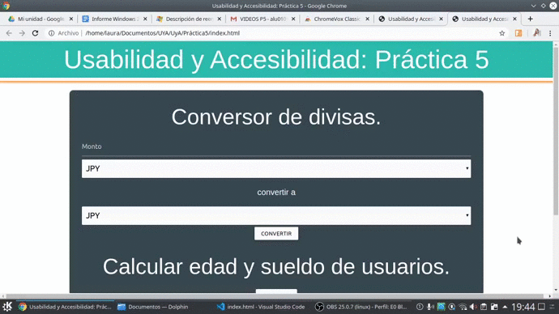
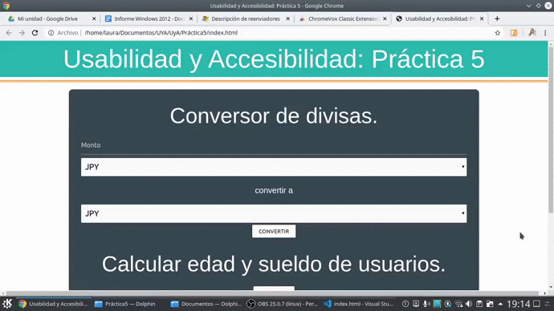
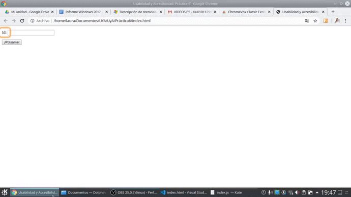
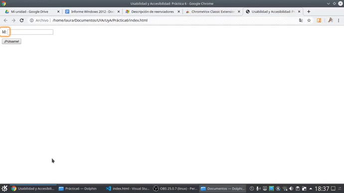

# Práctica 8

Las prácticas que se han tenido en cuenta son la 4, 5 y 6. 

## Práctica 4 sin WAI - ARIA:

Vemos como el usuario se mueve perfectamente por el header y footer, sin embargo, se salta el texto de qué es lo que ofrece nuestro banco del tiempo:

## Práctica 4 con WAI - ARIA:

Con WAI - ARIA solucionamos el problema anterior:

***

## Práctica 5 sin WAI - ARIA:

Sin el etiquetado, no podemos acceder al resultado de cada una de las operaciones que realiza nuestra página. 

## Práctica 5 con WAI - ARIA:

Con el etiquetado correcto, podemos acceder a los resultados sin ningún problema.

***

## Práctica 6 sin WAI - ARIA:

Sin el etiquetado WAI - ARIA no se puede acceder al texto que genera la petición.

## Práctica 6 con WAI - ARIA:

Se añade el etiquetado, y podemos acceder a dicho texto.

